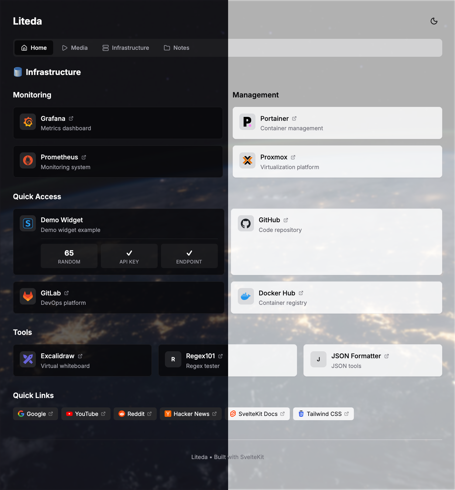

# Liteda

A lightweight, memory-efficient dashboard for your homelab. Built with SvelteKit for fast performance and simple YAML configuration.



## Features

- 🚀 **Lightweight** - ~50-80MB base memory usage
- ⚡ **Fast** - Built with SvelteKit and Svelte 5 for snappy performance
- 📄 **Simple Config** - YAML files + Markdown pages, no database needed
- ✨ **IDE Support** - JSON schema validation with autocompletion for configs
- 🎨 **Customizable** - Themes, backgrounds, flexible header layout
- 📱 **Multi-page** - Organize services into tabbed pages
- 🔀 **SSR Proxy** - Server-side API calls, no CORS issues with your services
- 🧩 **Extensible** - Widget system for monitoring popular homelab services

## Quick Start

```bash
# Install dependencies
bun install

# Development
bun dev

# Build
bun run build

# Preview production build
bun preview
```

## Configuration

All configuration files are in the `config/` directory:

```
config/
├── schemas/           # Auto-generated JSON schemas (run: bun run schema)
├── settings.yaml      # Global settings, theme, layout, header
├── services.yaml      # Default home page
└── pages/             # Additional pages
    ├── media.yaml     # YAML page
    ├── infra.yaml
    └── notes.md       # Markdown page with frontmatter
```

**IDE Support**: Config files include JSON schema validation for autocompletion and error checking. Generate schemas with:
```bash
bun run schema
```

## Project Structure

### Core Components

```
src/lib/
├── widgets/           # Service monitoring widgets (always loaded)
├── gadgets/           # Header bar components (always loaded)
├── features/          # Heavy optional functionality (lazy loaded)
├── i18n/translations/ # Translation files
├── config/            # Config loader and schemas
└── components/        # UI components
```

**Widgets** - Service monitoring cards:
- Location: `src/lib/widgets/`
- Auto-discovered via Vite glob
- Always bundled and loaded (eager import)
- Lightweight (~10-30 KB each)
- Examples: Portainer, Jellyfin, Proxmox, qBittorrent
- See: [Widget System](#widgets)

**Gadgets** - Header bar components:
- Location: `src/lib/gadgets/`
- Auto-discovered via Vite glob
- Always bundled and loaded (eager import)
- Lightweight (~10-30 KB each, ~80 KB total)
- Examples: Weather, resources, search, theme-switcher
- See: [Addons](#addons)

**Features** - Heavy optional functionality:
- Location: `src/lib/features/`
- Manually registered in `loader.ts`
- Lazy loaded only when enabled in config
- Heavy dependencies allowed (~1-5 MB)
- Can inject services, modify config
- Future examples: Docker discovery, Kubernetes integration

**Translations** - i18n language files:
- Location: `src/lib/i18n/translations/`
- JSON files for each locale (e.g., `en.json`, `zh-TW.json`)
- Auto-loaded based on `settings.yaml` locale setting
- Keys organized by component/feature

### settings.yaml

```yaml
title: My Dashboard
theme: dark  # light, dark, auto

background:
  image: https://example.com/bg.jpg
  opacity: 0.3
  blur: 2

layout:
  columns: 3
  # Customizable header with gadgets
  header:
    - type: title
    - type: spacer
    - type: theme-switcher

pages:
  - id: home
    name: Home
    icon: home
    file: services.yaml
  - id: notes
    name: Notes
    icon: folder
    file: pages/notes.md
```

### Service Groups

```yaml
# Flat group with items
- name: Quick Access
  columns: 2
  equalHeight: true  # Cards in same row have equal height (default: true)
  items:
    - name: Portainer
      icon: portainer
      url: https://portainer.local
      description: Container management
      widget:
        type: portainer
        interval: 10000
        vars:
          url: https://portainer.local
          key: "your-api-key"
          env: 1

# Nested groups
- name: Infrastructure
  icon: server
  columns: 2
  groups:
    - name: Monitoring
      items:
        - name: Grafana
          icon: grafana
          url: https://grafana.local
    - name: Management
      items:
        - name: Proxmox
          icon: proxmox
          url: https://pve.local

# Bookmarks style (compact tags)
- name: Quick Links
  type: bookmarks
  items:
    - name: Google
      url: https://google.com
      icon: google
```

### Markdown Pages

Create `.md` files with frontmatter for mixed content pages:

```markdown
---
blocks:
  tools:
    name: Common Tools
    type: services
    columns: 2
    items:
      - name: Portainer
        url: https://portainer.local
        icon: portainer
---

# Server Notes

Some documentation here...

::: block:tools :::

More content below the service cards...
```

## Widgets

Widgets display live data from your services. They use a three-file structure with auto-discovery.

### Structure

```
src/lib/widgets/my-widget/
├── meta.ts       # Widget definition + schemas
├── handler.ts    # Server-side data fetching
└── Widget.svelte # UI component
```

### Creating a Widget

**meta.ts**
```typescript
import { z } from 'zod';
import { defineWidget } from '../utils/define';
import Widget from './Widget.svelte';

export default defineWidget({
  name: 'my-widget',
  component: Widget,
  description: 'My custom widget',
  
  dataSchema: z.object({
    status: z.string(),
    count: z.number(),
  }),
  
  varsSchema: z.object({
    url: z.string().url(),
    apiKey: z.string(),
  }),
});
```

**handler.ts**
```typescript
import { createHandler } from '../utils/create-handler';
import widget from './meta';

export const POST = createHandler({
  varsSchema: widget.varsSchema,
  
  async fetch(vars) {
    const res = await fetch(`${vars.url}/api/status`, {
      headers: { Authorization: `Bearer ${vars.apiKey}` },
    });
    const data = await res.json();
    return { status: data.status, count: data.total };
  },
});
```

**Widget.svelte**
```svelte
<script lang="ts">
  import type { WidgetProps } from '../types';
  import widget from './meta';
  import { useWidget } from '../utils';
  import { Block, Row, Status } from '$components/widget-ui';

  let { config }: WidgetProps = $props();
  const { data, loading, error } = useWidget(widget, () => config);
</script>

<Block>
  {#if loading}
    <Skeleton class="h-8" />
  {:else if error}
    <span class="text-destructive">{error}</span>
  {:else if data}
    <Status status={data.status === 'ok' ? 'healthy' : 'error'} />
    <Row label="Count" value={data.count} />
  {/if}
</Block>
```

### Widget Features

- **Auto-discovery** - Just create the folder, no registration needed
- **Type-safe** - Zod schemas for data and vars validation
- **Server-side caching** - Prevents duplicate requests from multiple clients
- **Secure** - `vars` (API keys) never sent to browser

### Built-in Widgets

**12+ widgets available** covering common homelab services:

- **Infrastructure**: Portainer, Proxmox, Nginx Proxy Manager, Cloudflare Tunnel
- **Media**: Jellyfin, Plex, Sonarr, Radarr, qBittorrent
- **Monitoring**: Uptime Kuma, Grafana, AdGuard Home

> 📁 See all widgets in [`src/lib/widgets/`](src/lib/widgets/) directory

## Gadgets

Gadgets are lightweight components for the header bar. Like widgets, they use auto-discovery and are always loaded.

### Structure

```
src/lib/gadgets/my-gadget/
├── meta.ts      # Gadget definition
└── Addon.svelte # UI component
```

### Built-in Gadgets

**6 gadgets available** for header customization:

- `title` - Display site title
- `spacer` - Flexible space (pushes items to the right)
- `theme-switcher` - Light/dark mode toggle
- `search` - Global search with keyboard shortcuts (⌘K / Ctrl+K)
- `resources` - System resources monitor (CPU, memory, disk, temp)
- `weather` - Current weather display with detailed popover

> 📁 See all gadgets in [`src/lib/gadgets/`](src/lib/gadgets/) directory

### Header Configuration

Customize your header bar with various gadgets:

```yaml
layout:
  header:
    - type: resources      # System monitor on the left
    - type: spacer         # Push remaining items to the right
    - type: weather        # Current weather
      vars:
        latitude: 25.0330
        longitude: 121.5654
        label: "Taipei"
    - type: search         # Global search (⌘K)
    - type: theme-switcher # Theme toggle
```

## Docker

```bash
docker build -t liteda .
docker run -p 3000:3000 -v ./config:/app/config liteda
```

Or with docker-compose:

```yaml
services:
  liteda:
    build: .
    ports:
      - "3000:3000"
    volumes:
      - ./config:/app/config
    restart: unless-stopped
```

```bash
docker compose up -d
```

## Tech Stack

- [SvelteKit](https://kit.svelte.dev/) - Full-stack framework
- [Svelte 5](https://svelte.dev/) - UI with runes ($state, $derived, $effect)
- [shadcn-svelte](https://shadcn-svelte.com/) - UI components
- [Tailwind CSS](https://tailwindcss.com/) - Utility-first styling
- [Zod](https://zod.dev/) - Schema validation
- [mode-watcher](https://github.com/svecosystem/mode-watcher) - Theme management
- [unplugin-icons](https://github.com/unplugin/unplugin-icons) - Icon components (Lucide)
- [Dashboard Icons](https://github.com/walkxcode/dashboard-icons) - Service icons via CDN

## Development

### Adding a New Widget

1. Copy the template: `cp -r src/lib/widgets/_template src/lib/widgets/my-widget`
2. Edit `meta.ts` with your schemas
3. Implement `handler.ts` for data fetching
4. Build UI in `Widget.svelte`
5. Use in config with `widget.type: my-widget`

### Adding a New Gadget

1. Create folder in `src/lib/gadgets/`
2. Add `meta.ts` with `defineGadget()`
3. Create `Addon.svelte` component
4. Use in `settings.yaml` header config
